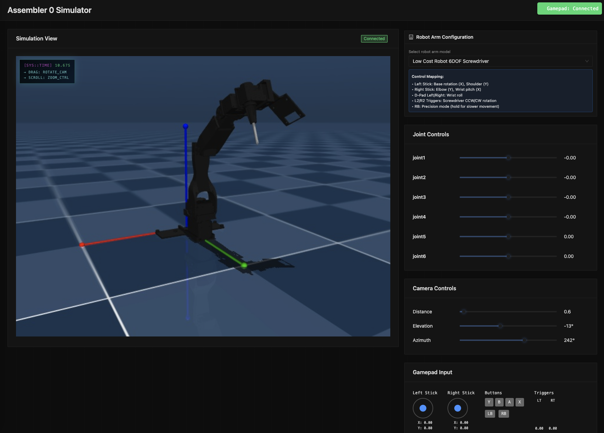

# Assembler 0 Robot Simulator

Server side MuJoCo simulator with browser based frontend.



## Installation

### Prerequisites

**Note:** This simulator requires a Linux machine with an NVIDIA GPU for headless rendering.

Install `uv` for fast Python package management:
```bash
curl -LsSf https://astral.sh/uv/install.sh | sh
```

### Setup

```bash

# Or if you want to use a virtual environment
uv venv
source .venv/bin/activate
uv pip install -e .

# Install frontend dependencies
cd src/assembler0_simulator/frontend
npm install
```

## Usage

### Start the backend server
```bash
cd src/assembler0_simulator/backend
python main.py
```

### Start the frontend development server
```bash
cd src/assembler0_simulator/frontend
npm run dev
```

Access the simulator at `http://localhost:1337`

## Requirements
- Linux with NVIDIA GPU (EGL rendering support required)
